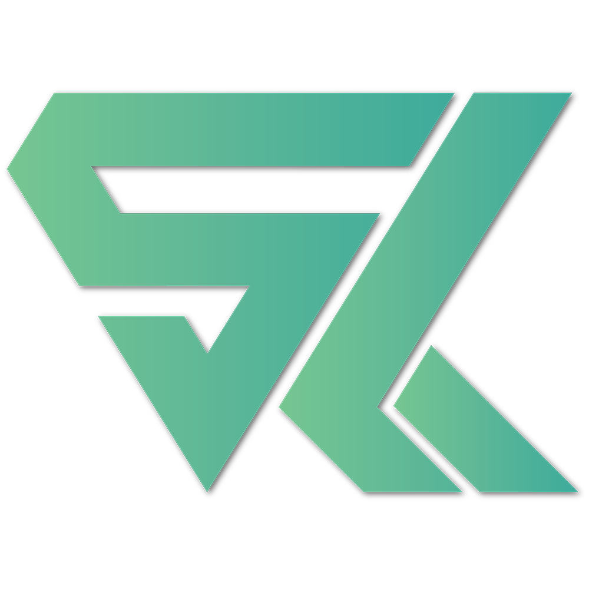
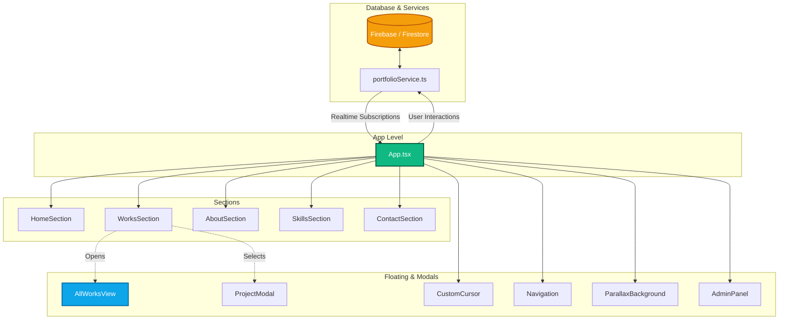

<div align="center">
  
  <h1>Sayham Kayes - Portfolio</h1>
  <p><strong>A Highly Interactive, 3D Parallax & Snap-Scrolling Developer Portfolio</strong></p>
</div>

---

## 📖 Overview

**Motion-Craft-Portfolio** is the personal portfolio of **Sayham Kayes**, a Full Stack AI Developer. The application showcases a stunning, high-performance, and immersive web experience. It utilizes cutting-edge web design paradigms including full-page snap-scrolling, dynamic mouse-driven parallax 3D backgrounds, glassmorphism UI layers, and seamless view transitions. 

The portfolio dynamically retrieves its content (Projects, Skills, Messages, Settings) from a database and features an integrated **Admin Content Management System (CMS)**, allowing real-time edits without touching the source code.

## ✨ Key Features

- **Interactive 3D Parallax Background:** A dynamic, floating SVG wave background that reacts to mouse movements and section changes.
- **FullPage Snap-Scrolling:** A seamless, single-page presentation layout that snaps elegantly between sections using a custom wheel interceptor.
- **Global Theme & Aesthetics:** A sleek cyber/neo-futuristic design primarily using **Emerald and Teal** gradients, frosted glass panels (Glassmorphism), and modern typography.
- **"All Works" Extended View:** A custom-built, full-screen grid view to showcase a comprehensive portfolio beyond the main snap-scroll interface.
- **Admin CMS Panel:** Secure, built-in dashboard to view messages from clients and adjust site settings (Sound, Parallax intensity, Snap scroll).
- **Responsive & Mobile First:** Meticulously crafted layouts, touch-swipe navigation listeners, and scaling typography for desktop, tablet, and mobile.

## 🛠️ Technology Stack

- **Frontend Framework:** React 18
- **Build Tool:** Vite
- **Language:** TypeScript
- **Styling:** Tailwind CSS (with arbitrary value capabilities and animations)
- **Icons:** Lucide React
- **Backend / Database:** Firebase / Firestore (Configuration managed via `portfolioService.ts`)
- **Hosting:** Configured for Vercel / Cloud Run (via AI Studio config)

## 🏛️ Architectural Graph

The architecture of the application relies on a robust `App.tsx` container that manages the global navigation state (active section), subscriptions to the database, and scroll/swipe interception.



## 📂 Project Structure

```text
Motion-Craft-Portfolio/
├── public/                 # Static assets (images, icons)
├── src/
│   ├── components/         # Reusable UI components
│   │   ├── sections/       # Primary full-page slide components
│   │   ├── AdminPanel.tsx  # Integrated CMS dashboard
│   │   ├── AllWorksView.tsx# Extended portfolio grid view
│   │   ├── CustomCursor.tsx# Interactive pointer replacement
│   │   ├── Navigation.tsx  # Top header navigation
│   │   ├── ParallaxBackground.tsx # Mouse-driven dynamic background
│   │   └── ProjectModal.tsx# Case study detail modal
│   ├── data/               # Fallback / initial dataset (`initialData.ts`)
│   ├── services/           # Backend integration (`portfolioService.ts`)
│   ├── utils/              # Helper utilities (`audio.ts` for UI sounds)
│   ├── App.tsx             # Root component & scroll interceptor logic
│   ├── index.css           # Global Tailwind directives & custom animations
│   ├── main.tsx            # React mounting point
│   └── types.ts            # Global TypeScript interfaces
├── .env.example            # Environment variables template
├── package.json            # Project dependencies & scripts
├── tailwind.config.js      # Custom theme, colors, and keyframe animations
└── vite.config.ts          # Vite build configuration
```

## 🚀 Getting Started

To run this project locally on your machine, follow these steps:

### Prerequisites
- **Node.js** (v16.x or higher)
- **NPM** or **Yarn**

### Installation

1. **Clone the repository:**
   ```bash
   git clone https://github.com/SayhamKayes/Motion-Craft-Portfolio.git
   cd Motion-Craft-Portfolio
   ```

2. **Install dependencies:**
   ```bash
   npm install
   ```

3. **Configure Environment Variables:**
   - Copy the example `.env` file:
     ```bash
     cp .env.example .env.local
     ```
   - Add any required API keys or Database Configuration strings into `.env.local`.

4. **Start the Development Server:**
   ```bash
   npm run dev
   ```
   Open your browser and navigate to `http://localhost:5173`.

---

<div align="center">
  <p>Designed and Built by <strong>Sayham Kayes</strong></p>
</div>
